# Workload - Scalable Web App
	

###Scalable Web Application example implemented in Cloud Foundry 

We will be deploying a messaging web application that will utilize and demonstrate
the Bluemix services "Monitoring and Analytics", "Autoscale", and "Cloudant NoSQL DB".

## Introduction

A messaging web application has been created that we will depoly into our personal space
after signing up for Bluemix and the DevOps service. We will attach the the
"Monitoring and Analytics", "Autoscale", and "Cloudant NoSQL DB" servcies and provide instructions
into understanding how the applications works and how to monitor the attached services.  

## Sign up for / Log into Bluemix and DevOPs

Sign up for Bluemix at https://console.ng.bluemix.net/ and DevOps Services at https://hub.jazz/net . When you sign up, you'll create an IBM id, create an alias, and register with Bluemix.

For more information, refrence the Bluemix getting started documents at - 

## Create Node.js Application and Attach Services
 
Our first goal is to create a Node.js Application through the Bluemix UI. After we have done that, we will create and bind
a Cloudant NoSQL Database. This will be used to store messages that we spam. We will then create and bind the "Monitoring and Analytics"
and "Autoscaling" services. Bluemix provides these services embedded in the Bluemix Service Catalog. Once we have created the Node.js Application
with the services attached, we will set out to fork (copy) the application's code and deploy it over the blank Node.js application.

	1) Log into your Dashboard at https://console.ng.bluemix.net/
    2) From the main dashboard page select "CREATE AN APP"
    
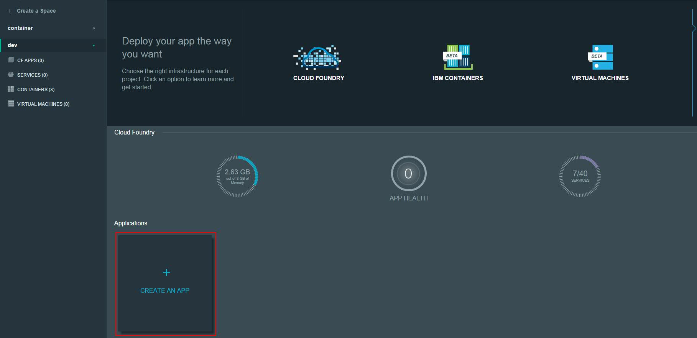

    
This will bring up and window to select either "Web" or "Mobile".
	
	3) Select "Web"
	4) In the next window, Select "SDK for Node.js"
	
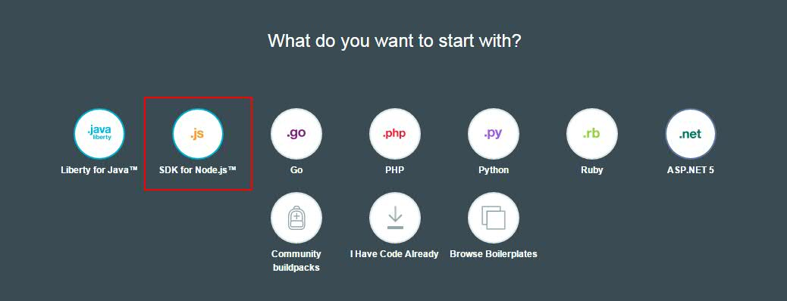

	5) In the next window, select "Continue"
	6) In the next window, where it says "App Name" give a name for your web application and select "FINISH"
	
It will take a while for the application to be create/stage. After it finishes staging, you have succesfully created a blank Node.js application in Bluemix. 
You should now see the application in your main dashboard in your "Applications" category. We will now create and bind the services to our blank Node.js application. 

	1) From main select your application you just created

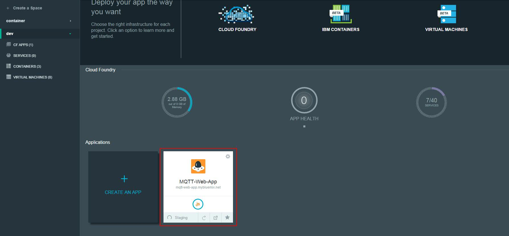

This will take you into the application's personal dashboard where we can add/bind services.

	2) In the application window select "ADD A SERVICE OR API"
	
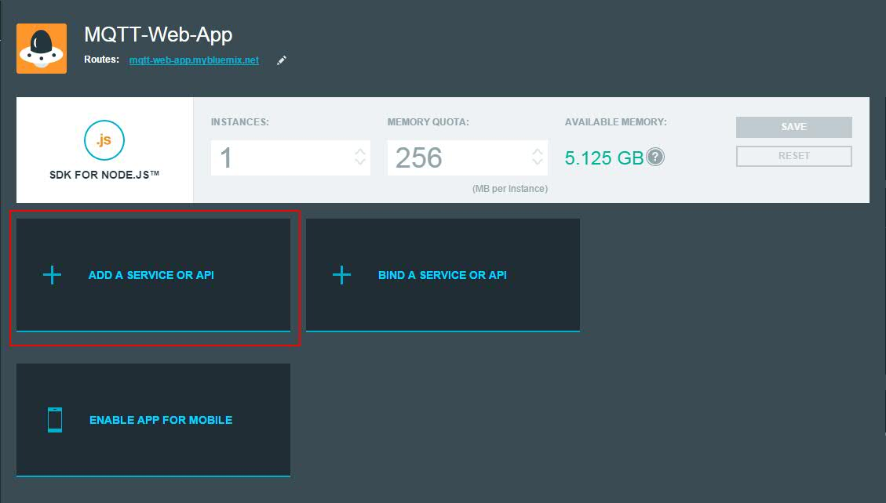

The window that pops up is the Services Catalog. 

	3) In the top search bar type "cloudant" and select "Cloudant NoSQL DB"

	
This will bring up a box where you need to fill in information about how/where the Cloudant service will sit.

	 In the "Space" select your the space in which your blank Node.js application sits
	 In "App:" select your "Application"
	 In "Service name:" field put any name you want
	 In your "Selected Plan:" select your desired plan
	 Select "CREATE"

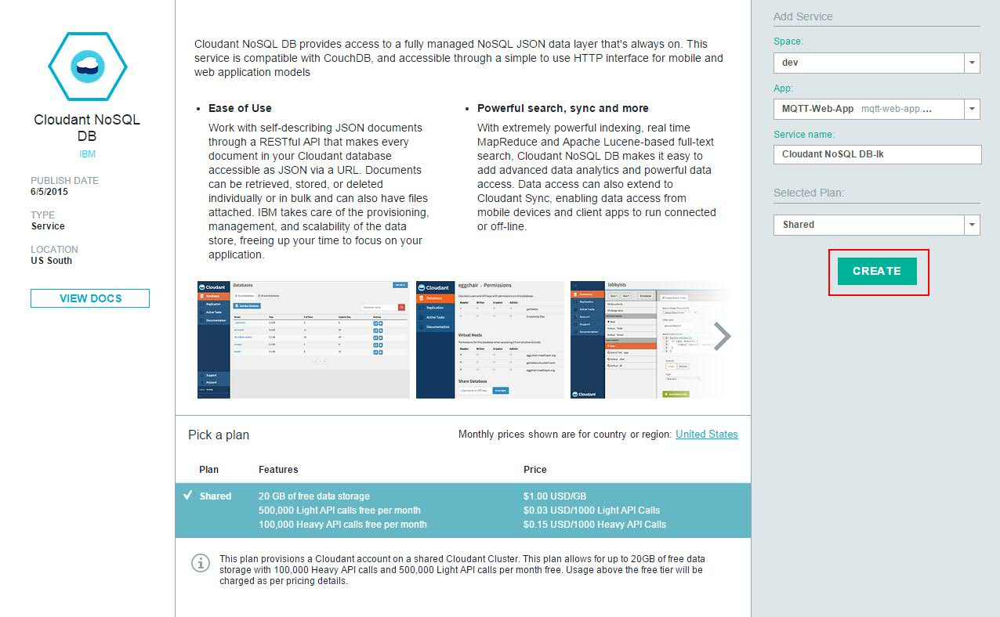

You have successfully deployed and binded an instance of Cloudant NoSQL DB to your blank Node.js application. 
For more information on Cloudant please see the docs at - 

https://www.ng.bluemix.net/docs/#services/Cloudant/index.html#Cloudant

At this point, we have our blank Node.js application with a binded instance of a Cloudant databsae. For this part of the tutorial, we will be adding
"Monitoring and Analytics" and "Auto-Scaling" services to the application.

	1) In the application window select "ADD A SERVICE OR API"

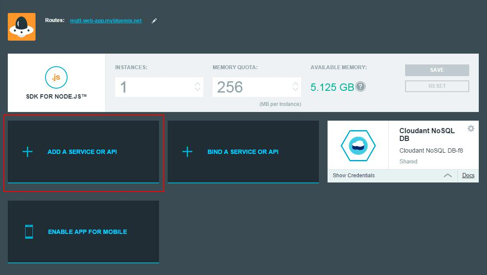

This will bring up the Bluemix Services Catalog
	
	2) In the top search bar type "Monitoring and Analytics" and select "Monitoring and Analytics"

This will bring a windows where you will need to provide information about where to attach the service.

	 In "Space:" field select your space where your blank Node.js application resides
	 In "App:" field select your application
	 In "Selected Plan:" field select your desired plan
	 Select "CREATE" and then select "RESTAGE" when it pops up ( it might do this for you automatically )
	 
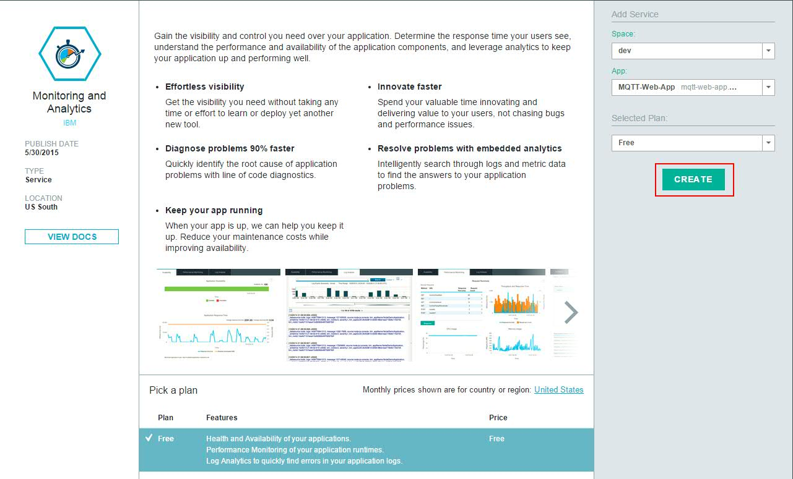
 
We have now successfully attached the "Monitoring and Analytics" service to our web application.

	1) Go back to your application page and select "ADD A SERVICE OR API" 
	2) In the top search bar type "Auto-Scaling" and select "Auto-Scaling"

This will bring a windows where you will need to provide information about where to attach the service.

	In "Space:" select your space where your blank Node.js application resides
	In "App:" select your application 
	In "Selected Plan:" select your desired plan
	Select "CREATE" and then select "RESTAGE" when it pops up ( it might do this for you automatically )

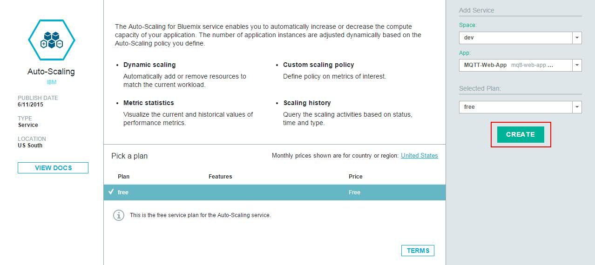
	
You have now successfully binded "Monitoring and Analytics" and "Auto-Scaling" services to your web application.

## Fork project to personal Jazz Repo space 
	
Our next goal, is to fork the publicly accessible repository hosted in hub.jazz.net into your 
personal DevOPs space. Once we do this, we will be able to deploy the code to Bluemix and spin
up instances of the Web Application. 
	
	1) From https://hub.jazz.net/git/ank/Mosca-Cloudant/ select "Fork Project" in top right of the page

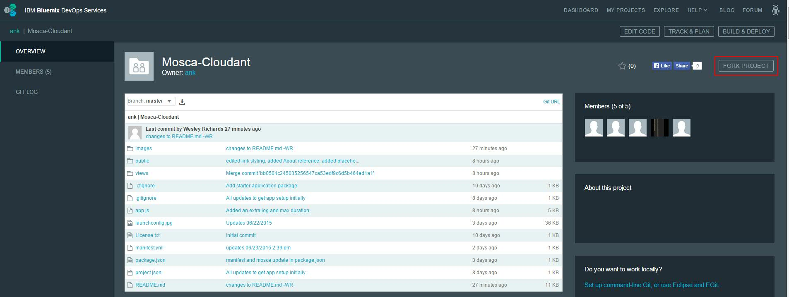

 A menu will pop up where you will need to provide infomation on where the code will be forked 
	to.

	1) In the first field "Name your project:" name the project the same name your named your blank node.js app
	2) Check "Make it private" if you want the repo to be private, otherwise leave unchecked
	3) Keep "Make this a Bluemix Project" checked
	4) Select your the Region, Organization, and Space as your blank Node.js app and select "Create". 

You have successfully forked this application code to your personalJazz Hub space.
To find more about Bluemix's DevOPs features reference the DOCs at - 
https://hub.jazz.net/docs

## Deploy to Bluemix through Jazz Hub

Next, we will take the repository, with the application code we just foked, and deploy over the the blank Node.js 
application we created. The services we create earlier will still be binded.

	1) From your DevOPs project page, you just created, select "EDIT CODE" at the top right

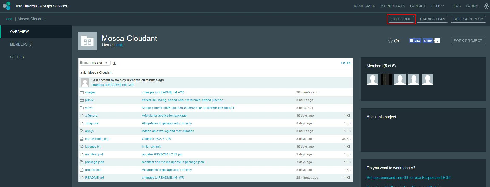

In your "EDIT CODE" window  you will see the files that are contained in the application's code.

	2) In your "EDIT CODE" window click the drop down menu, found above the code files, and select the pencil symbol to edit launch configuration

A window will pop up and you will be required to enter information about where the code will be
deployed to.

	 In the "Launch Config Name*:" field give a Config Name 
	 In the "Target*:" field select your region that your blank Node.js app sits
	 In the "Organization*:" field select your organization where your blank Node.js app sits
	 In the "Space*:" field select your Bluemix Space where your Node.js application sits
	 In the "Manifest File:" field leave the default of "manifest.yml"
	 In the "Application Name" field select the name of your blank Node.js application in the drop down
	 In the "Host" field select the hostname you gave for your Node.js application in the drop down
	 In the "Domain" field leave default at "mybluemix.net"
	 Click "Save"

]

	1) In your "EDIT CODE" window select the "Play" button to deploy your application to bluemix

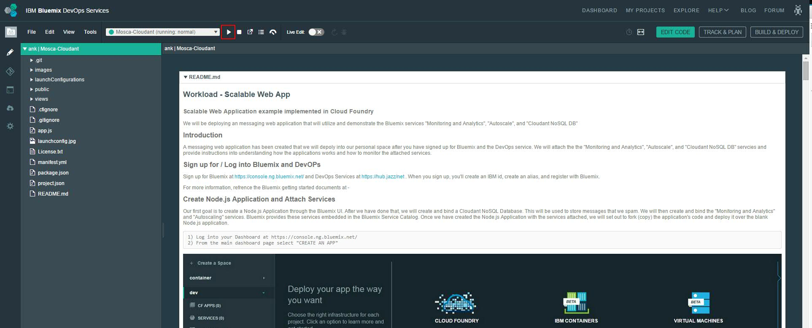

Once you click "Deploy" it will reference the launch configurations you specified and read your
manifest.yml and push the code and override the code of your blank Node.js application.

## Monitoring Application Performance

Now, we will review how to utilize the "Monitoring and Analytics" service and obtain data on the
web application. 
	
For learning how to utilize the data provided in this service see -
https://www.ng.bluemix.net/docs/#services/monana/index.html#gettingstartedtemplate
	
	1) return to your application's dashboard and the top of the screen you will see the routes listed for this application

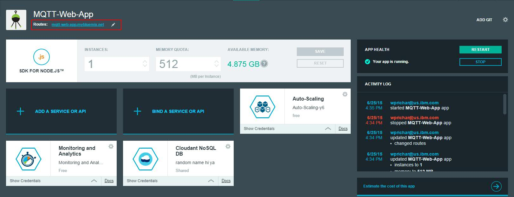

These are your applications publicly accessible DNS names that you put into your browser to launch the application
	
	2) Click on anyone of your routes to load the "Web Messenger" application

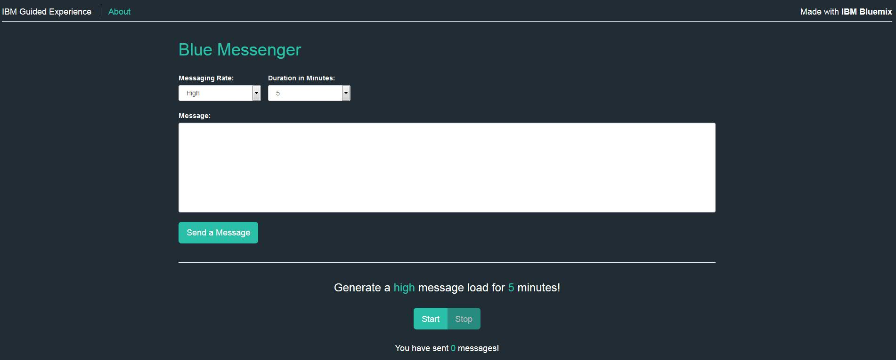

From the main page you will see a 'Messaging Rate:' dropdown where you specify the speed/rate of the messages 
that get spammed to the database. Also, in the 'Duration in Minutes:' dropdown you select how many minutes
the spamming will go on for. In the "Message:" box you put your messages that will be sent to the database,
when you spam. Finally, at the bottom of the webpage you will see "Start" and "Stop" buttons where you
will initiate and stop the spamming.
	
	3) In the 'Messaging Rate' box put any message you would like to spam
	4) Set the rate to 'Medium'
	5) Set your duration to '5'
	6) Click 'Start'

You have just succesfully started the spamming of messages to the database. To see the messages populated click on your
Cloudant service in the Application's Dashboard. Also, click on the "Monitoring and Analytics" service in your
Application's Dashboard to see and utilize the information you learned in the "Monitoring and Analytics" document 
refrenced above. 

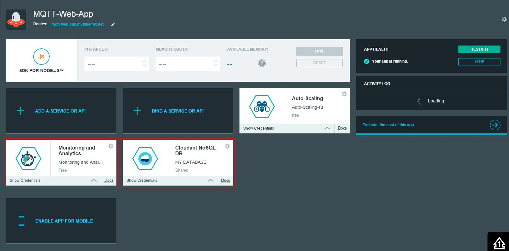
	

## Test Auto-Scaling

We are now going to stress our application and monitor the Auto-Scaling service at work.
	
First we must become familiar with the service by reading through the Bluemix documentation on Auto-Scaling at -
https://www.ng.bluemix.net/docs/#services/Auto-Scaling/index.html#autoscaling

	1) From our application's dashboard select the "Auto-Scaling" Service

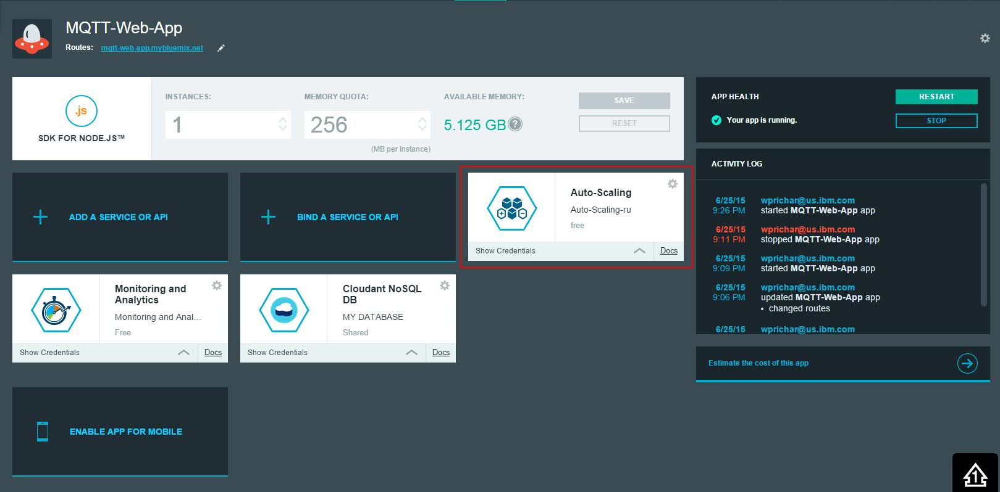

In here you can utilize the Auto-Scaling service shown in the document refrenced above.

	2) Create Auto-Scaling policy to do testing under the "Policy-Configuration" tab

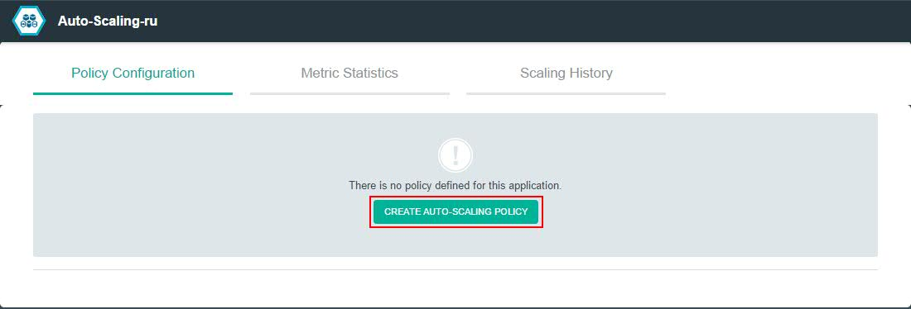

Once we starting spaming and stressing the server we can monitor the auto scaling from the "Metric Statistics"
and "Scaling History" tabs.

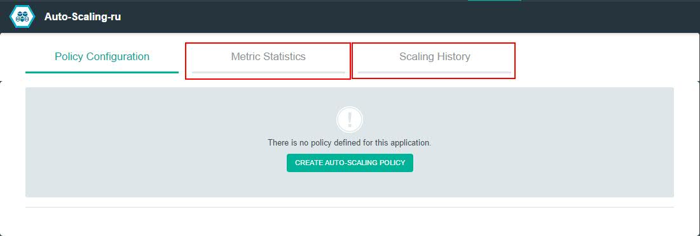

To start the stress so you can monitor auto scaling from the 'Auto-Scaling' service.

	1) Reload the webpage for the application by selecting one of the routes 
	2) In the 'Messaging Rate' box put any message you would like to spam
	3) Set the rate to 'High'
	4) Set your duration to '5'
	5) Click 'Start'  

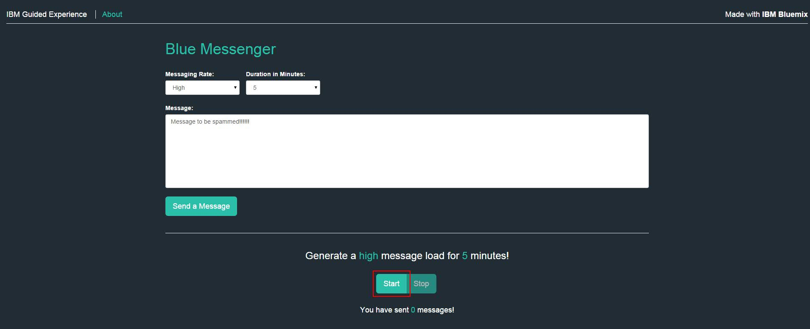

	
## DevOps Pipeline 

Here, we are going do an overview of the DevOps Pipeline service Bluemix provides so you can become familiar
how to utilize it for future changes to this or other applications.
	
	

## Getting Familiar with the Application

In section we are going to do an overview of the actual code and what the app is actually doing in the 
background. 

	