# Workload - Scalable Web App
	

###Scalable Web Application example implemented in Cloud Foundry 

		
## Big Picture

	We will be deploying an messaging web application that will utilizes and demonstrates
	Bluemix services "Monitoring and Analytics", "Autoscale", and "Cloudant NoSQL DB"

###Workflow - 

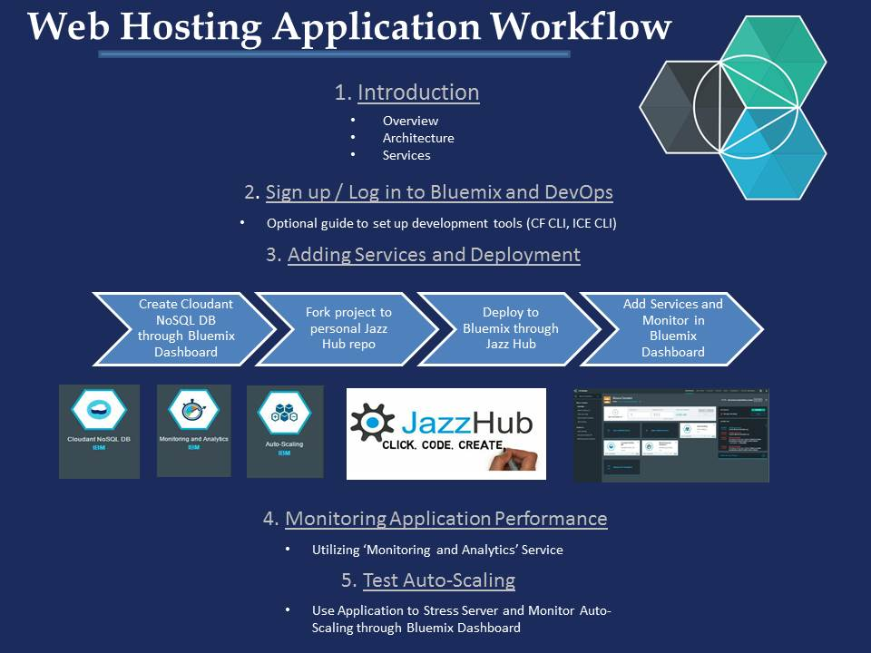

## Introduction

	A messaging web application has been created that we will depoly it into our personal space
	after you have signed up for the Bluemix and their DevOps servies . We will attach the the
	"Monitoring and Analytics", "Autoscale", and "Cloudant NoSQL DB" servcies and provide instruction
	into understanding how the applications works and how to monitor the attached services.  

## Sign up for / Log into Bluemix and DevOPs

	//TODO - Making a guide for signing up for bluemix

## Create Cloudant NoSQL DB through Bluemix Dashboard
 
	At this point, our first goal is to create a Cloudant NoSQL Database for our app that will 
	be used to store data when we write spam messages. Bluemix provides Cloudant as a embedded 
	service located in the service catalog. Once we have created the Cloudant instance, we will
	set out to fork (copy) the application code and deploy it while binding (attaching) our 
	newly created Cloudant instance at runtime of the deploy.
	
* Log into your Dashboard at https://console.ng.bluemix.net/
* From main page scroll down till you see and select "ADD A SERVICE OR API"
* In the next window, in the top search bar type "cloudant" and select "Cloudant NoSQL DB"

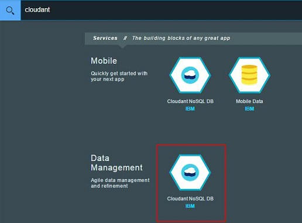

	
	This will bring up a box where you need to fill in information about your Bluemix and 
	how/where the Cloudant service will sit

* In the "Space" select your desired space in your Bluemix account
* In "App:" select "Leave unbound"
* In "Service name:" put "Cloudant NoSQL DB-xh" [explain changing to "pc" or to remember name for manifest]
* In your "Selected Plan:" leave it as default "Shared"
* Select "CREATE"

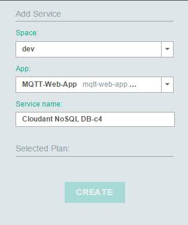

	You have successfully deployed a standalone instance of Cloudant NoSQL DB into your personal Bluemix space. 
For more information on Cloudant please see the docs at - 

https://www.ng.bluemix.net/docs/#services/Cloudant/index.html#Cloudant

## Fork project to personal Jazz Repo space 
	
	Our next goal, is to fork the publicly accessible repository hosted in hub.jazz.net into your 
	personal DevOPs space. Once we do this we will be able to deploy the code to bluemix and spin
	up instances of the Web Application. 
	
* From https://hub.jazz.net/git/ank/Mosca-Cloudant/ select "Fork Project" in top right of page

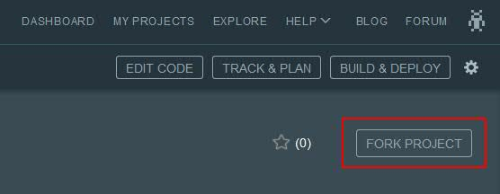

	A menu will pop up where you will need to provide infomation on when the code will be forked 
	to.

* In the first field "Name your project:" name the project "MQTT-Web-App"
* Check "Make it private" if you want the repo to be private, otherwise leave unchecked
* Keep "Make this a Bluemix Project" checked
* Select your desired Region, Organization, and Space and select "Create". The space needs to 
be in the same where you assigned your Cloudant database service in the last section.

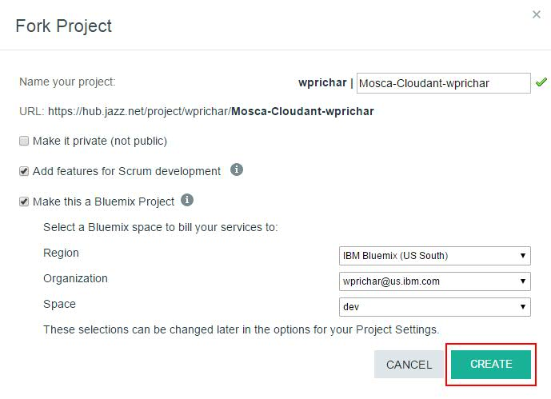

	You have successfully forked this application code to your personalJazz Hub space.
To find more about Bluemix's DevOPs features reference the DOCs at - 
https://hub.jazz.net/docs

## Deploy to Bluemix through Jazz Hub

	Next, we will take the repository, with the application code we just foked, and deploy it to
	bluemix. Once we have done this, we will have a running application we can monitor and add 
	services to.

* From your DevOPs project page, you just created, select "EDIT CODE" at the top right

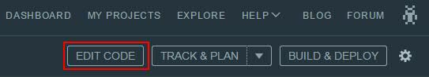

	 In your "EDIT CODE" window  you will see the files that are contained in the application's code

* double click the manifest.yml which will display the file
* In the "host:" field you will see "mqtt-web-app" ... we need to append to the end of this hostname and make it unique because the host name
will be used as your DNS name and is publicly accessible .. I this case I will add "test749" to the end of the "mqtt-web-app"

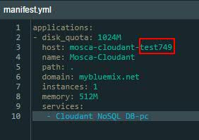

* In your "EDIT CODE" window click the drop down found above the files located in the code and select the pencil symbol to edit launch configuration

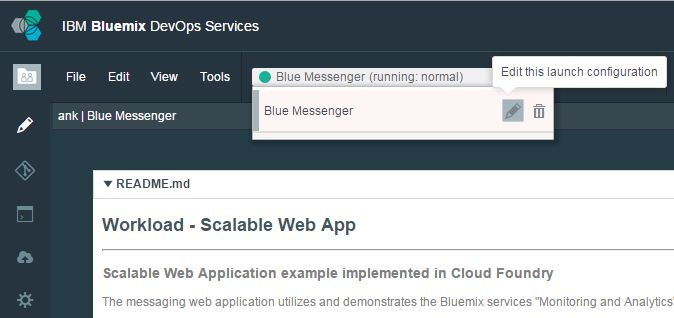

	A window will pop up and you will be required to enter information about where the code will be
	deployed to.

* In the "Edit Launch Configuration" window
	* In the "Launch Config Name*:" field give a Config Name 
	* In the "Target*:" field select your region
	* In the "Organization*:" field select your desired org
	* In the "Space*:" field select your Bluemix Space you want to deploy to
	* In the "Application Name" field put the host name you specified in your manifest.yml
	* In the "Host" field put "Mosca-Cloudant"
	* In the "Domain" field leave default at "mybluemix.net"
	* Click "Save"

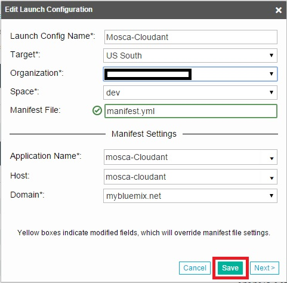]

* In your "EDIT CODE" window select the "Play" button to deploy your application to bluemix

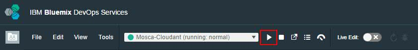

	Once you click "Deploy" it will reference the launch configurations you specified and read your
	manifest.yml and push the code and bind the Cloudant service to the area specified. 

## Add Services and Monitor from Bluemix Dashboard

	At this point, we should have a running application in our Bluemix space, that we specified,
	and can now add desired services through the Bluemix UI. For this tutorial, we will be adding
	"Monitoring and Analytics" and "Auto-Scaling".

* Log into your Dashboard at https://console.ng.bluemix.net/
* From main select your application you just created ... default is "MQTT-Web-App"

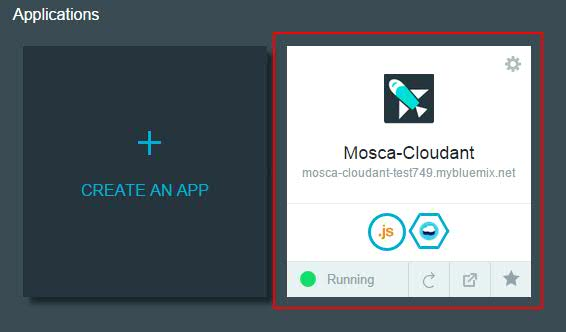

	This will take you into the application's personal dashboard where we can add/bind services

* In the application window select "ADD A SERVICE OR API"

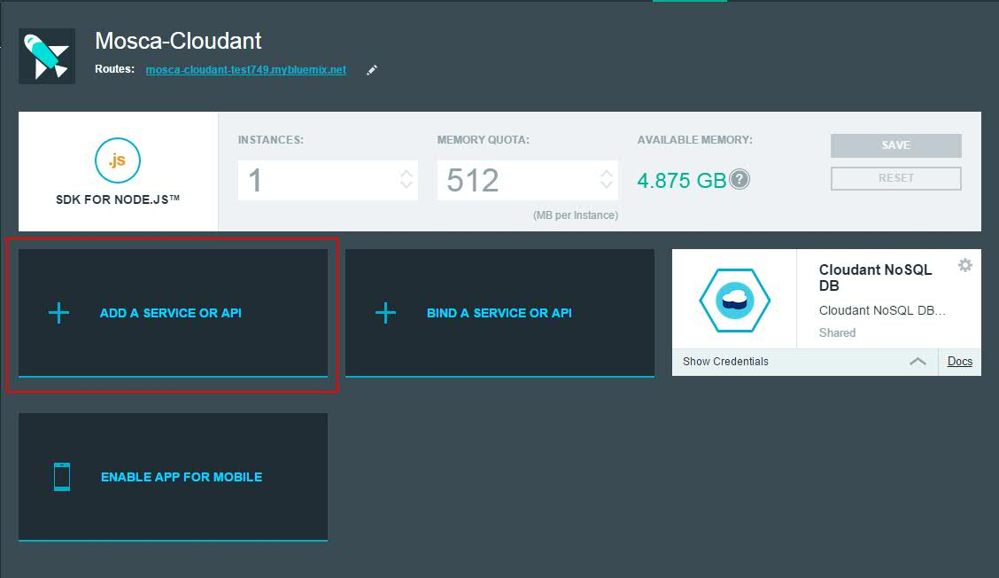

	This will bring up the Bluemix Services Catalog
	
* In the top search bar type "Monitoring and Analytics" and select "Monitoring and Analytics"

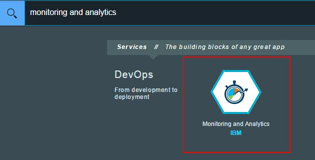

	This will bring a windows where you will need to provide information about where to attach the service.
* In "Space:" field select your space our newly created application resides
* In "App:" field select your app 
* In "Selected Plan:" field select your desired plan
* Select "CREATE" and then select "RESTAGE" when it pops up ( it might do this for you automatically )

	 
	 We have now successfully attached the "Monitoring and Analytics" service to our web application.

* Go back to your application page and select "ADD A SERVICE OR API" again
* In the top search bar type "Auto-Scaling" and select "Auto-Scaling"

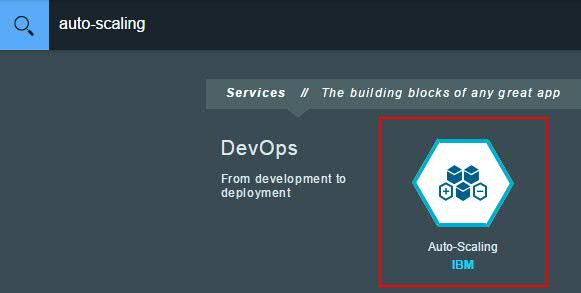

	This will bring a windows where you will need to provide information about where to attach the service.

* In "Space:" select your space our newly created application resides
* In "App:" select your app 
* In "Selected Plan:" select your desired plan
* Select "CREATE" and then select "RESTAGE" when it pops up ( it might do this for you automatically )

	
	You have now successfully binded "Monitoring and Analytics" and "Auto-Scaling" services to your web application

## Monitoring Application Performance

	Now, we will review how to utilize the "Monitoring and Analytics" service and obtain data on the
	web application. 

	BABABABBABABABABABABABABABABABABABABABABABA