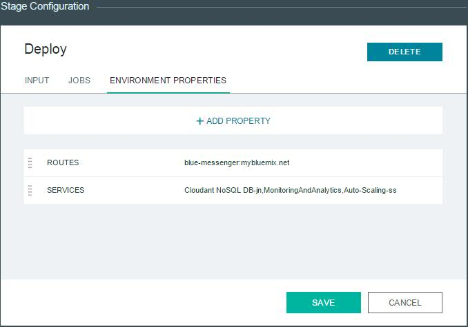

# Workload - Scalable Web App

###Scalable Web Application Example Implemented in Cloud Foundry

The messaging web application utilizes and demonstrates
the Bluemix services **Monitoring and Analytics**, **Autoscale**, and **Cloudant NoSQL DB**.

----

## Introduction

A messaging web application has been created so you can deploy it into your personal space
after signing up for Bluemix and the DevOps service. You will attach the
**Monitoring and Analytics**, **Auto-Scaling**, and **Cloudant NoSQL DB** services to the application
as well as learn how to begin using these services.

## Sign up for / Log into Bluemix and DevOps

Sign up for Bluemix at https://console.ng.bluemix.net and DevOps Services at https://hub.jazz.net.
When you sign up, you'll create an IBM ID, create an alias, and register with Bluemix.

## Create Node.js Application and Attach the Services

The goal is to create a Node.js application through the Bluemix UI. You will use the initial Node.js
application to add Bluemix services.  You will create and bind a Cloudant NoSQL Database.
This will be used to store messages that we send. We will then create and bind the Monitoring and
Analytics and Autoscaling Services. Bluemix provides these services embedded in the Bluemix Service
Catalog. Once we have created a Node.js application with these services, we will set out to fork (copy)
the application's code and deploy it over the starter Node.js application.

1. Log into your Dashboard at https://console.ng.bluemix.net.
2. From the Dashboard page select **CREATE AN APP**. This will open a window to select either Web or Mobile.
3. Select **Web**.
4. In the next screen, select **SDK for Node.js**.
5. Now, where it says **App Name**, specify a name for your web application and take note for
when you fork your project.

    It may take a while for the application to be created and staged. Once it finishes staging,
you will have succesfully created a starter Node.js application in Bluemix. You should now see the
application in your Dashboard in the **Applications** category. We will now bind services to our starter
Node.js application.

6. In the left sidebar, select Overview to take you into the application's dashboard where we can
add/bind services.
7. Click **ADD A SERVICE OR API**. This directs you to the Services Catalog.
8. In the top search bar, type "cloudant."
9. From the **Data Management** category, select **Cloudant NoSQL DB**.

    

    This will bring up a page where you will configure the Cloudant service.

10. Accept the default values.
11. Make note of your **Service name** that you will use later.
12. Click **CREATE**.
13. Restage your application when prompted.

You have successfully deployed and bound an instance of Cloudant NoSQL DB to your starter Node.js
application.

At this point, we have our starter Node.js application with a binded instance of a Cloudant database.
Using what you've learned, add the services **Monitoring and Analytics**, **Auto-Scaling** and **Globalization Pipeline** to your
application.

Once you have successfully bound "Monitoring and Analytics", "Auto-Scaling" and "Globalization Pipeline" services to your web
application, your app's dashboard should appear like this:

- [ ] _todo: add Globalization Pipeline here_

## Fork Project to a Personal DevOps Space

Our next goal is to fork a publicly accessible repository hosted in http://hub.jazz.net into your
personal DevOps space. Once we do this, we will be able to deploy the code to Bluemix and spin
up instances of the Web Application.

1. Navigate to [the tutorial's repository](https://hub.jazz.net/project/ank/Blue%20Messenger/overview).
2. In top right of the page, click **Fork Project**
	* A menu will pop up where you will need to provide infomation on where the code will be forked
	to.
3. In **Name your project**, use the name you chose for your starter Node.js app.
4. Choose the **Space** that your starter Node.js app was created in and click **CREATE**.

You have successfully forked this application code to your personal Jazz Hub space.
To find more about Bluemix's DevOps features reference the docs at
https://hub.jazz.net/docs.

## Deploy to Bluemix through DevOps Services

You can now configure your application code for deployment to your own Bluemix environment.
You will be overwriting the deployed starter Node application, taking advantage of the services
you previously configured.

1. On your DevOps Services project page, click **EDIT CODE** at the top right. This opens your web IDE.
	* In your web IDE you will see the a forked copy of this README.md.
2. Click the drop-down menu, found above the code files, and select the pencil symbol to edit launch configuration.

    

     A window will pop up and you will be required to enter information about where the code will be
deployed to.

3. In the **Launch Config Name** field, give a Config Name.
4. In the **Target** field, select your app's region.
5. In the **Organization** field, select your app's organization.
6. In the **Space** field, select your app's Bluemix space.
7. In the **Manifest File** field, leave the default of manifest.yml.
8. In the **Application Name** field, select the name of your starter Node.js application.
9. In the **Host** field, select the hostname you gave for your Node.js application.
10. In the **Domain** field, leave default at mybluemix.net.
11. Click **Save**.

    

12. To the right of the configuration dropdown, click the **Play** button to deploy your application
to Bluemix.
13. Navigate to your **Bluemix Dashboard** and select your application to view its deployment status.
14. Once your application is finished deploying, click on the **Routes** link to be navigated to your
new web app.

## What Does the App Do?

Your new web application is a simple web server that can recieve MQTT messages. The server will write
the contents of each message it recieves to your Cloudant database. The purpose of the application is
to allow you to experiment with workloads and the Bluemix services.

Looking at your deployed application, you will see a **Messaging Rate** dropdown where you specify the
rate at which messages are sent to the database. In the **Duration in Minutes** dropdown, you can select
how many minutes the automated messaging will persist. In the **Message** box, you can enter a message
that will be sent to the database. The message is optional when sending messages using the **Start**
button. At the bottom of the webpage you will see **Start** and **Stop** buttons that you use to initiate
and stop the messaging.

1. In the **Message** box put any message you would like to send.
	* You may send individual messages by clicking **Send a Message**.
2. Set the rate to **Medium**.
3. Set your duration to **5** minutes.
4. Click **Start**.

You have just succesfully started sending messages to your web server. To see the messages populated,
click on your Cloudant service in the application's dashboard. Navigate to the Monitoring and Analytics
service in your application's dashboard to view the effects of the new workload on your application.

For more information on Monitoring and Analytics see the
[getting started page](https://www.ng.bluemix.net/docs/#services/monana/index.html#gettingstartedtemplate).

## Experimenting with Auto-Scaling

We are now going to stress our application and monitor the Auto-Scaling service at work.

1. From your application's Dashboard select the **Auto-Scaling** Service.
	* Here you can utilize the Auto-Scaling service shown in the document referenced above.
2. Create Auto-Scaling policy to do testing under the **Policy-Configuration** tab.
	* Note that in the Advanced Configuration options you can adjust the time it takes to scale your app.

Once we start sending messages to stress the server, we can monitor auto-scaling from the **Metric
Statistics** and **Scaling History** tabs.

For more information on the Auto-Scaling service please
[visit the documentation](https://www.ng.bluemix.net/docs/#services/Auto-Scaling/index.html#autoscaling).

## DevOps Pipeline

This section describes how to deploy updates to the app with zero downtime using the DevOps Pipeline. Once set up, any changes pushed to your repository will automatically be deployed
to the production application. New instances of the application will be created to match the existing application.  The appropriate services will then be bound to the
new application and the applications workload will be switched to the new deployment.  The old iteration of the application is then deleted.  All of this this is done utilizing Cloud Foundry commands
found in the **deploy.sh** script in the root directory of the web IDE.

1. Update your manifest.yml.
	1. In your web IDE, you'll find a **manifest.yml** file in your root directory. This contains
information that your Build and Deploy pipeline will need.
	2. Update your **host** to be your application's hostname.
	3. Update your **name** to be your application's name.
2. Copy to clipboard the contents of **deploy.sh**.
	1. In your web IDE, you'll find a **deploy.sh** file in your root directory. This contains
    information that your zero downtime deployment will need.
	2. Highlight this entire script and right click twice and select **copy** to copy to clipboard. We will paste this information in the deploy script section of
	our pipeline later.
3. In your application's DevOps Services page, click on **Build and Deploy** in the top right. This will take you to the Build and Deploy Pipeline Welcome panel.
4.  Add a build stage to your pipeline.
	1. Click **ADD STAGE**.
	2. Provide a name for the stage (Build) and select the SCM Repository for the Input Type.
	3. Under **Stage Trigger** select **Run jobs whenever a change is pushed to GIT**.
	4. In the **Jobs** tab, click **ADD JOB** and select **Build**.
	5. Click **SAVE**.
5. Add a deploy stage to your pipeline.
	1. Click **ADD STAGE**.
	2. Provide a name for the stage (Deploy) and select the Build Artifacts for the Input Type.
	3. Under **Stage Trigger** select ** Run jobs when the previous stage is completed**.
	4. In the **Jobs** tab, click **ADD JOB** and select **Deploy**.
	5. In the **Deploy Script** box, highlight everything and right click paste the contents of the **deploy.sh** file from earlier.
	6. In the **ENVIRONMENT PROPERTIES** tab, click **+ADD PROPERTY** and select **Text Property**.
	7. In the newly created field where it says **Name**, type **ROUTES** and in the **Value** box type the **HOST:DOMAIN** of your **Blue Messenger** application.
	8. Click **ADD PROPERTY** and select **Text Property** again.
	9. In the **Name** box type **SERVICES** and in the **Value** box list the name of the services attached to your current Blue Messenger application separated by commas. "no spaces" are allowed after the comma separating the services.
	10. Click **SAVE**.

   
6. Add a test stage to your pipline.
	1. Click **ADD STAGE**.
	2. Provide a name for the stage (Test).
	3. Under **Stage Trigger** select **Run jobs when the previous stage is completed**.
	4. In the **Jobs** tab, click **ADD JOB** and select **Test**.
	5. In the **Test Command** window, add a simple test for your application.  
		* For example: `curl http://<your hostname>.mybluemix.net/`
	6. Click **SAVE**.
7. Make change to application to show change after deployment.
	1. Add the lines of code, found below, to the bottom of your /public/stylesheets/style.css in your web IDE. This change will make the corners of the buttons pointed and not curved.

			.btn-lg{
	    	    border-radius: 0;
			}

8. To demonstrate zero downtime deployment press the play button on the Build stage. This will build,
deploy, and test your application. Spam the database within your Blue-Messenger application, while
the deployment stage is running. You can monitor the deployment stage by clicking **View logs and history**. Once the pipeline has completed refresh your application in the browser and you will see the change to the buttons' edges. 

## Experimenting with Globalization Pipeline

1. Add languages besides English:
	1. From your application's Dashboard select the **Globalization Pipeline** Service.
	2. You should see a bundle named after your application, such as `blue-messenger-ac`
	3. The English side has all of the source strings for your application. 
	4. Choose "Add Language" and you can add a new target language for your application.
	5. Restart the application to pick up the list of target languages.
	6. Change your browser's preferred language and reload the page, you will see it in the new language.
2. You can edit translations in the Dashboard and they will be reflected immediately.
3. To edit the English (source) content:
    1. Update `index.html` by changing some text such as a button title.
		* To add content, make sure that it has class `t` such as `Hello World!`
		* If possible, add an `id=` attribute to disambiguate your strings: `Hello World!`
		* To add strings not visible in `index.html`, add them to `public/scripts/en-extra.json`
	2. run `npm run gen-i18n` to update the `en.json` file in the source code.
	3. Push your updated code and restart the application. The `en.json` file will be uploaded to Globalization Pipeline automatically.
